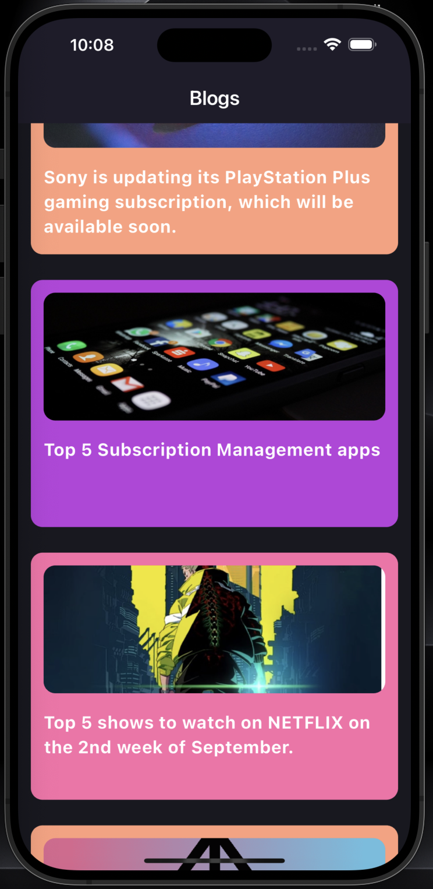
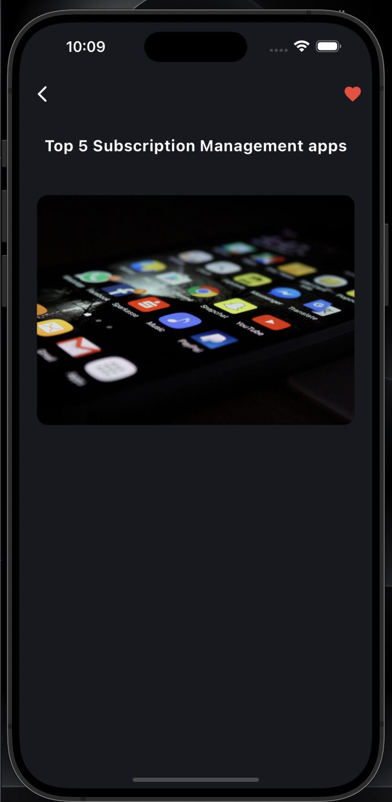

# subspace_task

A new Flutter project for managing blogs.

## Getting Started

This project is a starting point for a Flutter application. The app fetches blog data from a remote API, caches images locally, and displays the blogs in a list. 

### Features

- Fetch blogs from remote API
- Cache images locally for offline access
- Display blogs in a list with different colors

### Screenshots

#### Home Screen

#### Blog Details Screen

### Installation

1. Clone the repository:
   git clone https://github.com/yourusername/subspace_task.git
   cd subspace_task
2. flutter pub get
3. flutter run  
